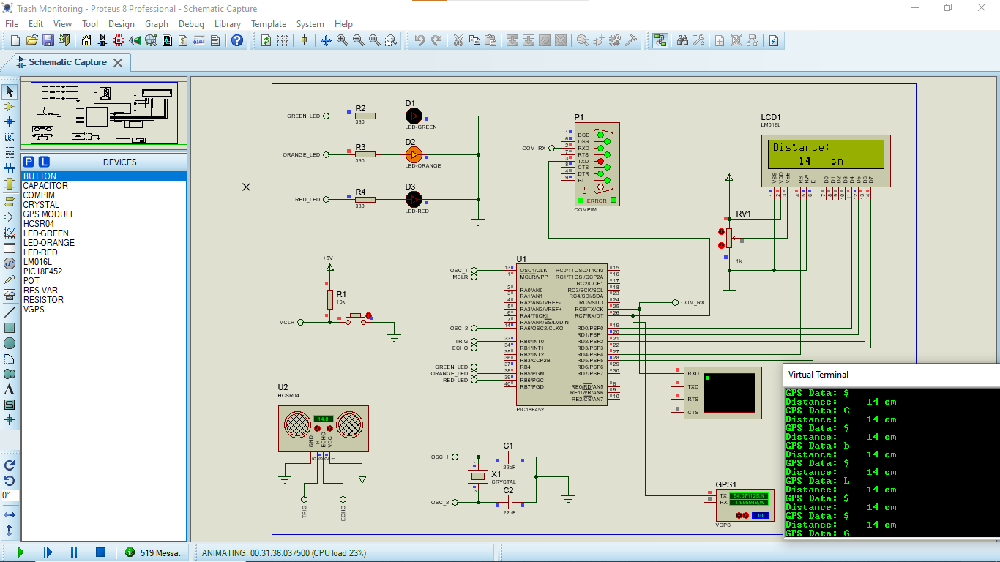

# Trash Monitoring System

This here is a simulation project for a smart city trash monitoring system which I built which can be implemented in the City of Harare.
This system is an IOT project which also has an embedded system built using mikroc and proteus as its simulation package.

To start this project, first clone the repo and run
```shell
npm install
```
in the directory of this project.
This so as to install the dependencies of this project.

You then need to install the database which is MySQL which you can do so by installing XAMPP and start the MySQL server.
Make sure that MySQL is added as an environment variable of the machine.
You can copy its path by going usually here
```path
C:\XAMPP\bin
```
Then past it environment variables.
You can get there by searching environment variables and go to environment variables and look for path and add a new path and paste the path.

After that open a new terminal and run 
```shell
source dump.sql
```
in the project directory and this will create the database for you. 

You now run the system by 
```shell
nodemon
```
or 
```shell
node index.js
```

You can also run the embedded system by installing proteus and following the design and then pasting the TrashMonitoringTest.hex in the mikroController which is a PIC18F452 microcontroller


